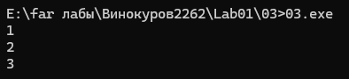
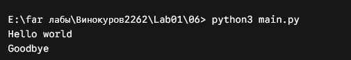

# Отчет по лабораторной работе 1
### Задание 1
* Прагматика - что нужно сделать
* Семантика - как будет работать
* Синтаксиси - как писать
* Исходный код - код (программа) написанный на высокоуровневом языке программирования
* Обьектный код - промежуточный код (представление) между исходным и исполняемым, все функции уже заменены на элементарные команды, а название переменных все еще такие же как в исходном коде
* Исполняемый код - код который непосредственно исполняется, набор элементарных инструкций
* Исполняемый фаил - файл, содержащий программу в виде набора элементарных инструкций, которая после загрузки в память может быть выполнена на определенном физическом устройстве под управлением ОС
* Ассемблер - язык программирования низкого уровня, в котором каждая иструкция физического устройства представлена в текстовом виде
* Язык программирования высокого уровня - язык абстрогированный от элементарных команд процессора, позволяющий записывать программы в виде более абстрактных понятий (функции, алгоритмы, классы)
* Транслятор - техническое средство, осущетвляющее перевод тукста с одного языка на другой (требуется для ЯП высокого уровня)
* Виртуальная машина - средство описания семантики языка программитрования
* Стандарт языка программирования - документ, описывающий язык программирования максимально подробно и, по возможности наиболее формально
* Компилятор - транслятор, переводящий программу в машинный код для последующего исполнения
* Интерпретатор - транслятор, читающий и исполняющий программу по одной команде
* Псевдо компилятор - транслятор, переводящий программу в промежуточное представление (байт-код), который состоит из набора инструкций близких по смыслу к машинному коду (выполняется на ВМ)
* Компилирующий интерпретатор - транслятор переводящий текст программы во внетреннем представление непосредственно после запуска
* REPL-интерпретатор - программное средство, работающее в цикла чтения-вычисления-печати
* Единица трансляции - минимальный фрагмент программы, который может быть транслирован независимо от остального кода
* Предобработка - выполнение замен в тексте программ по заданным правилам
* Синтактический анализ и генерация кода - проварка синтаксиса и генерация объектного кода или внутреннего представления программы
* Сборка (связывание) - Объединение отдельных модулей (едениц трансляции) и внешних библиотек в испольняемую программу
* Загрузка - загрузка программы в память для последущего исполнения
* Препроцессинг (предобработка) - начальный этап трансляции программы
### Задание 2
* Insert - выделение файла
* f4 - редактирование файла
* f5 - окно копирования файла / создание копии в открытой директории
* f6 - переименование файла / перенос файла в открутую директорию
* f8 - удаление файла(ов)
* shift + f4 - создание файла
* f7 - создание папки
* Dir - список фалов в директории
* copy - скопировать фаил имя_старого имя_нового
* mkdir - создание папки название_папки
* tab - смена активной директории (окна)
### Задание 3
Выполнение программы суммы чисел

### Задание 4
Преобразование файлов по отдельности
.png)
Сборка в маин
.png)
### Задание 5
Преобразование файлов в классы
.png)
Сборка в маин
.png)
### Задание 6
Сборка в маин

### Задание 7
Сборка через make
.png)
Проверка программы после сборки
.png)
Изменение файла сообщение спп, заставило пересобрать сам фил и основную программу, остальные файлы не тронуты
.png)
Изменение заголовка сообщения, так же пересобрало и файлы где он вызывается хеллоу и гудбай
.png)
### Задание 8
Вектор в 98 стандарте
.png)
Цикл по коллекции в 98 стандарте отсутствовал
.png)
Цикл по колекции добавили в 11 стандарте
.png)
Авто в 11 стандарте
.png)
Иницилизация вектора добавили в 11 стандарте
.png)
Двоичные литералы добавили в 11 стандарте
.png)
В 11 стандарте небыло определения типа конструкции
.png)
Определение типа конструкции добавили в 17 стандарте
.png)
### Задание 9
В оптимизации 0, команды изменены на машинный код
В оптимизации 1, команды изменены на машинный код, цикл выполняется отдельно (ничего не делает), ответ находится умножением
В оптимизации 2, команды изменены на машинный код, цикл отсутствует

