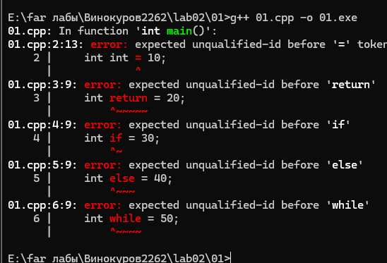
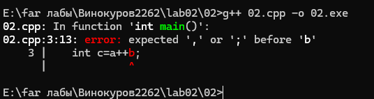
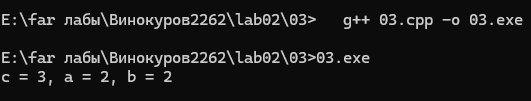
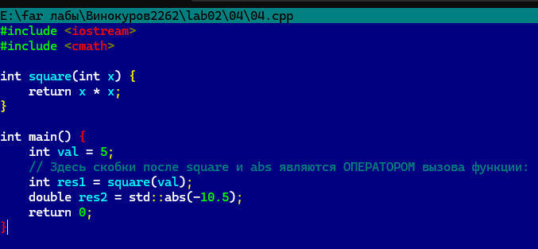
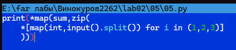
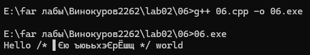

# Отчет по лабораторной работе 2
### Задание 1 **(2)**
* C++: int, return, if, else, while.

* Java: public, class, static, void, boolean.
.png)
* Python: def, import, for, in, pass.
.png)
Создать переменные с именами данных слов нельзя.
Ключевые слова зарезервированы синтаксисом языков программирования для обозначения встроенных конструкций,
поэтому компилятор или интерпретатор выдаст синтаксическую ошибку при попытке использовать их в качестве идентификаторов.

### Задание 2 **(2)**
**Ошибка при трансляции в C++:**

**Успешный запуск Python:**
.png)
**Разбиение на токены и объяснение:**
В С++ выражение c=a++b; разбивается на токены по принципу "максимального совпадения"(maximal munch): c, =, a, ++, b, ;.
Оператор ++ связывается с a (как постфиксный инкремент a++).
После этого компилятор ожидает бинарный оператор (например, + или *), но сразу встречает идентификатор b.
Возникает синтаксическая ошибка. В Python нет оператора инкремента ++. Выражение разбивается на токены: c, =, a, +, +, b.
Это интерпретируется как c = a + (+b), где первый + — это бинарное сложение, а второй + — унарный плюс перед переменной b.
Ошибки не возникает, результат равен 3.

### Задание 3 **(2)**
**Выполнение исходной программы:**

Значения переменных после исполнения: *c = 3, a = 2, b = 2.*
Разбиение на токены: *c, =, a, ++, +, b, ;.* Сначала вычисляется (a++), что возвращает старое значение 1, затем к нему прибавляется b (которое равно 2). Результат 3 записывается в c. После вычисления переменная a увеличивается на 1 и становится равной 2.

**Изменение разбиения на токены с помощью пробелов:**
Да, разбиение можно изменить, добавив пробел: *int c = a + ++b;.*

Токены изменятся на: *c, =, a, +, ++, b, ;.*
Теперь сначала выполняется префиксный инкремент ++b (значение b становится 3), затем результат складывается с a (которое равно 1). Итоговое значение c будет равно 4, a останется 1, b станет 3.

### Задание 4 **(2)**
**1. Круглые скобки ():**

* Являются оператором (оператор вызова функции):
Круглые скобки выступают оператором, когда они применяются к имени функции, указателю на функцию или функтору для её выполнения и передачи аргументов.
.png)
* НЕ являются оператором:
Круглые скобки не являются оператором, когда они используются для управления порядком вычисления выражений (группировки), а также в синтаксических конструкциях языков (условия if, циклы while/for, приведение типов и т. д.).

**2. Квадратные скобки []:**
.png)
* Являются оператором (оператор индексации):
Квадратные скобки являются оператором, когда используются для доступа к элементам массива, контейнера (например, std::vector, std::map) или при перегрузке operator[].
.png)
* НЕ являются оператором:
Квадратные скобки не являются оператором, когда они используются в синтаксисе объявления размера массива, в списках инициализации или в списке захвата лямбда-выражений.

### Задание 5 **(3)**

* Ключевые слова: for, in.
* Идентификаторы: print, map, sum, zip, int, input, split, i.
  * Задают переменные: i
  * Имена функций и методов: print, map, sum, zip, int, input — функции; split — метод.
* Литералы: 1, 2, 3.
* Операторы: * (распаковка аргументов), () (вызов функции/группировка), [] (создание списка), . (обращение к методу).

**Вызываемые функции и их параметры:**
1. input() — параметров нет.
2. split() (вызывается как метод результата input()) — параметров нет (по умолчанию разбивает по пробелам).
3. map(int, ...) — параметры: функция int и итерируемый объект (результат split()).
4. zip(*...) — параметры: распакованный список *[], содержащий 3 объекта map.
5. map(sum, ...) — параметры: функция sum и итерируемый объект (результат zip).
6. print(*...) — параметры: распакованная последовательность сумм.

**Как работает программа:**
Она считывает 3 строки ввода из консоли. Каждую строку разбивает на строковые числа методом split(), затем map(int, ...) преобразует их в целые числа. List comprehension генерирует список из этих 3 итераторов. Функция zip с оператором распаковки * транспонирует матрицу (группирует первые элементы всех трех строк вместе, вторые элементы вместе и т.д.). Внешний map применяет функцию sum к каждой сгруппированной колонке. Функция print распаковывает полученные суммы и выводит их через пробел на экран.


### Задание 6 **(2)**
В С++ комментарии записываются двумя способами: // (однострочный) и /* ... */ (многострочный).
1. 
cout<<"Hello /* Это комментарий */ world"; — Синтаксически верно. Скобки комментариев находятся внутри строкового литерала, поэтому компилятор воспринимает их как обычный текст.
2. .png)
// /* \n Это комментарий \n */ — Ошибка.
Символы /* после // игнорируются, так как находятся в однострочном комментарии. Следующая строка Это комментарий воспринимается компилятором как код, вызывая ошибку неизвестного идентификатора. */ также вызовет синтаксическую ошибку.
3. .png)
/* Я комментирую программы /* комментарий */ */ — Ошибка.
Язык C++ не поддерживает вложенные многострочные комментарии. Первый */ закроет комментарий, и оставшийся текст */ вызовет синтаксическую ошибку.
4. .png)
// Я комментирую программы /* комментарий */ — Синтаксически верно. 
Всё после // до конца строки считается комментарием, включая символы /* и */.
5. .png)
/* Я комментирую свои программы \n // Это комментарий до конца строки */ \n */ — Ошибка. Блок многострочного комментария закрывается первым встретившимся */. Оставшийся */ на следующей строке вызовет ошибку трансляции.

### Задание 7 **(4)**
*Найдите в стандарте С++*

[http://www.open-std.org/jtc1/sc22/wg21/docs/papers/2017/n4659.pdf]

*в приложении* **A.5** *формальные синтаксические правила для 
инструкций циклов* **iteration-statement.** *Опишите на естественном языке каждую строчку
из этих правил. Для каждой строчки из правила приведите короткий пример фрагмента программы,
которая построена по этому правилу.*

**Формат ответа.**

*Как видно из правил, есть ... (указать число) инструкции циклов.
Первый вид "--- цикл ...(название), который сответсвует строке правила*

*... (переписать строку из правила)*

* Формат записи (по правилу): ключевое слово* **<<while>>**, *в круглых скобках условие* **<<condition>>**,  
*далее инструкция* <<**statement**>>.

*Пример фрагмента программы.*
```
int x = 1;
while (x<1000) {
  cout << x;
  x *= 2;
}
```

### Задание 8 **(3)**
*В следующей программе постройте абстрактное синтаксическое дерево для выражения,
вычисляющего значение переменной* **a**.
```
int main() {
int a,x,y,z;
cin >> x >> y >> z;
a = -x+y*(z-1);
}
```