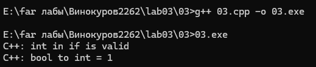
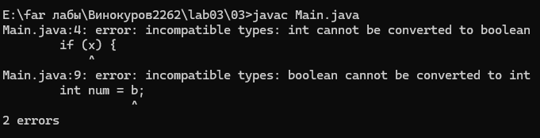
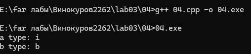
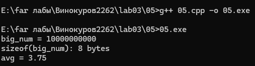
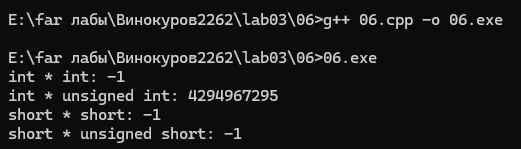
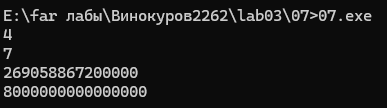
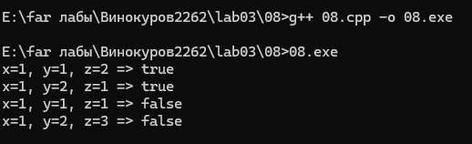
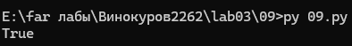
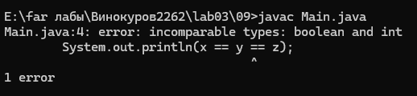
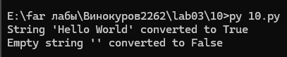

# Отчет по лабораторной работе 3

### Задание 1 **(3)** — Глоссарий
* **Тип в программировании** — абстракция, задающая множество допустимых значений данных и набор операций, которые можно выполнять над этими значениями, а также определяющая интерпретацию последовательности бит в памяти.
* **Статическая типизация** — подход, при котором типы переменных и объектов фиксируются на этапе компиляции/трансляции программы и не могут изменяться во время ее выполнения.
* **Динамическая типизация** — подход, при котором тип объекта данных определяется на этапе выполнения программы (runtime) в момент создания или присваивания значения.
* **Неявная типизация (вывод типов)** — механизма автоматического определения типа переменной транслятором на основе типа присваиваемого выражения без явного указания типа разработчиком (например, `auto` в C++).
* **Явное преобразование типа** — преобразование значения из одного типа в другой, явно указанное в тексте программы в виде вызова функции или специального оператора (например, `static_cast<int>(x)`, `float(c)`).
* **Неявное преобразование типа** — автоматическое преобразование значения одного типа к другому, выполняемое транслятором без явного указания в коде.
* **Сильная типизация** — характеристика системы типов, при которой язык программирования не содержит (или почти не содержит) правил неявного преобразования типов и строго контролирует соответствие типов, запрещая каламбуры типизации.
* **Слабая типизация** — характеристика системы типов, при которой язык содержит большое число правил неявного преобразования типов и допускает каламбуры типизации (рассмотрение одной ячейки памяти как разных типов).

### Задание 2 **(3)** — Правила неявного преобразования типов в С++

#### 1. Преобразования при присваивании:
* При присваивании значение правого операнда автоматически приводится к типу левого операнда.
* При вызове функций фактический параметр приводится к типу формального параметра.
* При преобразовании из вещественных в целочисленные происходит отсечение дробной части.

#### 2. Преобразования при арифметических действиях и сравнениях:
* **Целочисленное продвижение (integral promotion):** если длины обоих типов меньше `int` (например, `char`, `short`), операнды автоматически преобразуются к `int`.
* Если типы операндов разной длины, меньший тип преобразуется к большему.
* Если типы равной длины, но один знаковый, а другой беззнаковый, то знаковый тип приводится к беззнаковому.
* Если один операнд целый, а другой вещественный, целый операнд приводится к вещественному.

#### 3. Преобразования с логическими значениями:
* **Преобразование в `bool`:** значение `0` преобразуется в `false`, любое ненулевое значение — в `true`.
* **Преобразование из `bool`:** `false` преобразуется в `0`, `true` — в `1`.
* Результат условного выражения в инструкциях ветвления (`if`) и циклов (`while`, `for`) неявно приводится к логическому типу.
* Если оператор требует логического значения (операции `&&`, `||`, `!`), операнды приводятся к `bool`

### Задание 3 **(2)**

Язык C++ относится к языкам со слабой статической типизацией, так как допускает множество неявных преобразований типов (например, чисел в `bool` и наоборот). Java — язык с сильной статической типизацией, требовательный к точному соответствию типов.

#### Итог кода на C++ (`03.cpp`):

#### Итог кода на Java (`Main.java`):


* **Пояснение:** C++ свободно приводит целочисленные типы к bool и обратно. В Java тип boolean изолирован от числовых типов, поэтому компилятор выдаёт ошибку согласования типов (type error).

### Задание 4 **(1)**
#### Код программы (`04.cpp`):


**Объяснение результата:**
1. *Для a = x & y: оператор & — битовый И. Согласно правилу целочисленного продвижения в C++, операнды типа bool перед побитовой операцией приводятся к типу int (true $\rightarrow 1$, false $\rightarrow 0$). Результат битовой операции имеет тип int (вывод i или int).*
2. *Для b = x && y: оператор && — логический И. По правилам C++ он требует логических операндов и всегда возвращает логическое значение типа bool (вывод b или bool).*

### Задание 5 **(2)**
#### Итог программы (`05.cpp`):


**Пояснения:**
* typedef упрощает чтение кода при работе с громоздкими типами.
* auto избавляет от дублирования типа при инициализации.
* decltype позволяет объявлять переменные того же типа, что и переданное выражение.
* static_cast выполняет явное преобразование типов на этапе компиляции, предотвращая нежелательное целое деление.
* sizeof возвращает размер памяти, занимаемый типом в байтах.

### Задание 6 **(2)**
#### Итог программы (`06.cpp`):


**Объяснение работы:**
1. При int * unsigned int: операнды имеют одинаковую длину (32 бита). По правилу C++ знаковый int ($a = -1$) приводится к беззнаковому unsigned int. В 32-битной знаковой системе число -1 превращается в $2^{32} - 1 = 4294967295$. Результат: 4294967295.

2. При замене на short и unsigned short: так как длина обоих типов меньше int, срабатывает правило целочисленного продвижения (integral promotion). Оба операнда предварительно преобразуются к типу int! Значение -1 сохраняется как (int)(-1), умножается на (int)(1), давая в результате -1.

### Задание 7 **(2)**
#### Итог программы (`07.cpp`):


**Объяснение:**
1. В (x / y) / d: скобки выполняют целочисленное деление 7 / 4 = 1 (дробная часть отсекается). Затем 1 / 0.25 = 4.0. 
2. В (x / d) / y: сначала 7 / 0.25 = 28.0 (вещественное деление), затем 28.0 / 4 = 7.0.В (a * b) * c: сначала умножаются два типа long ($200\,000 \times 200\,000 = 40\,000\,000\,000$). Так как long в Win32/MinGW является 32-битным (максимум $\approx 2.14 \times 10^9$), происходит целочисленное переполнение. В a * (b * c): операция b * c неявно приводит b к типу long long (64 бита), умножение проходит без переполнения.

### Задание 8 **(2)**
#### Итог программы (`08.cpp`):


**Объяснение и все случаи:**
* Сравнения (x == y) и (x == z) возвращают bool (true или false).
* Операция сложения + приводит операнды bool к int (true $\rightarrow 1$, false $\rightarrow 0$).
* Сумма двух сравнений может быть равна 0, 1 или 2.
* Затем сумма сравнивается с true, которое неявно приводится к int со значением 1. Выражение возвращает true только тогда, когда сумма равна 1.

**Перечень всех случаев истинности:**
*Выражение истинно тогда и только тогда, когда выполняется ровно одно из равенств:*
1. $x == y$ и $x \neq z$
2. $x \neq y$ и $x == z$

### Задание 9 **(2)**
#### Python (`09.py`):

**Объяснение:**
*В Python поддерживает цепные операции сравнения. Выражение x == y == z эквивалентно (x == y) and (y == z).*

#### C++ (`09(1).cpp`):
.png)
**Объяснение:**
*В C++ оператор == левоассоциативен. Сначала вычисляется x == y (получается bool значение true / 1). Затем полученная единица сравнивается с z (1 == z). Выражение не проверяет равенство всех трёх переменных!*

#### Java (`Main.java`):

**Объяснение:**
*Java вычисляет (x == y) как boolean, а затем пытается сравнить результат типа boolean с числом z типа int. Так как Java строго типизирована, неявное приведение между boolean и int запрещено, что вызывает ошибку компиляции.*

### Задание 10 **(1)**
#### Итог кода (`10.py`):


**Объяснение:**
*В Python в логическом контексте (например, в условии if) объекты неявно приводятся к типу bool. Пустые коллекции и пустые строки "" преобразуются в False, а непустые строки — в True.*

# Отчет по выполненным задачам python на сайте Olymp.

### Задача 1 – Kisa and Osya was here
```python
name1 = input()
name2 = input()
print(name1, "and", name2, "was here")
```

### Задача 2 – Три плюс два
```python
first = input().split()
second = input().split()
print(first[0], second[0], first[1], second[1], first[2], sep=',')
```

### Задача 3 – Работа по письму
```python
w1, n1 = input().split()
w2, n2 = input().split()
w3, n3 = input().split()
total = len(w1) * int(n1) + len(w2) * int(n2) + len(w3) * int(n3)
print(total)
```

### Задача 4 – Строка в рамке
```python
s = input()
border = '*' * (len(s) + 4)
print(border)
print('*', s, '*')
print(border)
```

### Задача 5 – Время на дистанции
```python
h1, m1, s1 = input().split()
h2, m2, s2 = input().split()
start = int(h1) * 3600 + int(m1) * 60 + int(s1)
finish = int(h2) * 3600 + int(m2) * 60 + int(s2)
print(finish - start)
```

### Задача 6 – Обратный отсчёт
```python
n = int(input())
if n == 1:
    print('pusk')
else:
    print(n - 1)
```

### Задача 7 – Дырка
```python
a, b, c = map(int, input().split())
if a == 3 and b == 3 and c == 3:
    print('hole')
else:
    print(a + b + c)
```

### Задача 8 – Самое длинное слово
```python
a, b, c = input().split()
if len(a) > len(b) and len(a) > len(c):
    print(a)
elif len(b) > len(a) and len(b) > len(c):
    print(b)
else:
    print(c)
```

### Задача 9 – Больше меньше
```python
a, b = map(int, input().split())
if a < b:
    print('<')
elif a > b:
    print('>')
else:
    print('=')
```

### Задача 10 – Расстояние до отрезка
```python
a, b, c = map(int, input().split())
lo = min(a, b)
hi = max(a, b)
if c < lo:
    print(lo - c)
elif c > hi:
    print(c - hi)
else:
    print(0)
```

### Задача 11 – 3x+1
```python
n = int(input())
print(n, end='')
while n != 1:
    if n % 2 == 1:
        n = 3 * n + 1
    else:
        n = n // 2
    print('', n, end='')
print()
```

### Задача 12 – Ближайшая степень двойки
```python
n = int(input())
p = 1
while p * 2 <= n:
    p *= 2
print(p)
```

### Задача 13 – Номер в очереди
```python
count = 0
while True:
    name = input()
    count += 1
    if name == 'Petr':
        print(count)
        break
```

### Задача 14 – Не делится на ...
```python
n, a = map(int, input().split())
count = 0
x = a
result = []
while count < n:
    if x % 2 != 0 and x % 3 != 0 and x % 5 != 0 and x % 7 != 0:
        result.append(str(x))
        count += 1
    x += 1
print(' '.join(result))
```

### Задача 15 – НОД
```python
a, b = input().split()
a = int(a)
b = int(b)
while b != 0:
    a, b = b, a % b
print(a)
```
